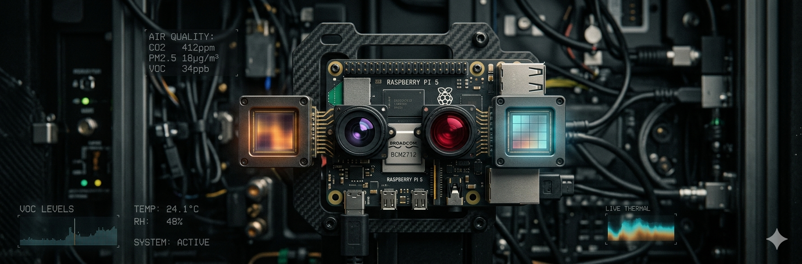

# 👁️ SensorHead

> **Physical senses for Claude Code** — give your AI eyes that see in darkness, a nose that smells the air, and a thermal gaze that reads heat signatures. Running on Raspberry Pi 5.

<p align="center">
  
</p>

---

## What Is This?

Claude Code is brilliant. But it's been blind, deaf, and anosmic — locked inside a terminal, reasoning about a world it cannot perceive.

**SensorHead fixes that.**

This is an MCP-connected sensor array that plugs real-world perception directly into Claude Code sessions. Point it at something. Ask Claude what it sees. Watch it describe the thermal signature of your coffee going cold, detect faces in pitch darkness, or tell you that your room smells like it's been 3 days since you opened a window.

It's a head. With senses. For your AI.

---

## Hardware Stack

| Sense | Hardware | What It Does |
|-------|----------|--------------|
| 👁️ **Vision (AI)** | Sony IMX500 AI Camera | On-chip inference — detection, classification, pose estimation *before* the frame leaves the sensor |
| 👁️ **Vision (Night)** | IMX708 Wide NoIR | Wide-angle, no IR filter — sees in total darkness with IR illumination |
| 🌡️ **Thermal** | MLX90640 | 32×24 thermal array, ironbow heatmaps, motion detection from heat |
| 👃 **Nose** | BME688 (BSEC2 v2.6.1) | Temperature, humidity, pressure, IAQ, CO₂ equivalent, VOC, gas resistance |
| 🧠 **Brain** | Raspberry Pi 5 (8GB) | Runs everything. USB-booted SSD. |

Everything mounts on a 3D-printed bracket and wooden riser platform. Both cameras share a vertical mount — IMX500 on top (CAM0), NoIR on bottom (CAM1).

---

## Architecture

```
Claude Code (MCP client)
        │
        ▼
  sensor-mcp script          ← MCP server, stdio transport
        │
        ▼
  SensorHead Dashboard        ← Python HTTP server, port 8080
        │
   ┌────┼────────────────┐
   ▼    ▼                ▼
IMX500  MLX90640      BME688
(CAM0) (I2C 0x33)   (I2C 0x77)
   +
IMX708
(CAM1)
```

The MCP server talks to the dashboard over localhost REST. Claude calls tools; tools call sensors; sensors return data. Simple, fast, composable.

---

## REST API

The dashboard exposes these endpoints on port 8080:

| Endpoint | Description |
|----------|-------------|
| `GET /api/status` | System health, sensor availability |
| `GET /api/models` | Available IMX500 AI models |
| `GET /api/capture/visual` | Full-colour image capture (IMX500) |
| `GET /api/capture/night` | NoIR low-light capture (IMX708) |
| `GET /api/detect` | Object detection via IMX500 on-chip inference |
| `GET /api/classify` | Image classification on-chip |
| `GET /api/pose` | Human pose estimation on-chip |
| `GET /api/thermal/heatmap` | Ironbow PNG heatmap from MLX90640 |
| `GET /api/thermal/data` | Raw 32×24 float array (°C) |
| `GET /api/environment` | BME688 full BSEC2 data (IAQ, CO₂eq, VOC, T/RH/P) |

---

## Quickstart

### 1. Clone & Install

```bash
git clone https://github.com/buckster123/SensorHead.git
cd SensorHead
pip install -e .
```

### 2. Start the Dashboard

```bash
sudo fuser -k 8080/tcp   # clear the port if needed
nohup sudo -E python3 -m sensor_head.dashboard --port 8080 \
  > /tmp/sensorhead-dashboard.log 2>&1 &
```

### 3. Connect Claude Code

Add the MCP server to your Claude Code config:

```json
{
  "mcpServers": {
    "sensorhead": {
      "command": "/path/to/SensorHead/sensor-mcp"
    }
  }
}
```

Then in Claude Code, just ask:

> *"What can you see right now?"*
> *"Is anyone in the room? Use thermal."*
> *"How's the air quality?"*

---

## Sensor Notes

### IMX500 (AI Camera)
- On-chip Sony AI processor — inference runs **on the sensor itself**, not the Pi
- Supports detection, classification, and pose estimation with swappable models
- Connect to CAM0 (near USB-C/Ethernet ports) with 22-pin wide-to-narrow FPC cable, **contacts facing DOWN**

### IMX708 NoIR Wide
- Connects to CAM1 (near power connector), same FPC orientation
- No IR filter = see in complete darkness with IR LEDs
- Wide angle makes it ideal for room-scale awareness

### MLX90640 Thermal
- I2C address `0x33`, shares bus with BME688 (`0x77`)
- Piggybacks off BME688 breakout's secondary header — SDA, SCL, GND shared; VIN → Pi 3.3V rail (**not** BME688's VDD which is 5V)
- Discard first 2 frames on startup (warm-up garbage)
- Boost I2C to 400kHz via `dtparam` for ~0.4s/frame instead of 1.4s

### BME688 + BSEC2
- Uses the official Bosch BSEC2 library (v2.6.1.0) via pi3g breakout
- IAQ accuracy: 0 (init) → 1 (uncertain) → 2 (calibrating) → **3 (calibrated)**
- Full calibration takes ~48 hours of continuous power — save state with `get_bsec_state()` / `set_bsec_state()`
- Reported temperature is compensated (~5°C below raw due to self-heating correction)
- CO₂ equivalent is VOC-correlated, not a direct CO₂ measurement

---

## Roadmap

- [ ] **Movement** — Oak pan-tilt mount, beefy servos, PCA9685 PWM driver
- [ ] **The Face** — Wave 7 3D agent face on attached monitor via Three.js
- [ ] **Cloud Bridge** — Connect to ApexAurum Cloud so remote agents can see through physical eyes
- [ ] **Voice** — Networked TTS/STT via laptop local API or MCP (not on Pi)
- [ ] **Autonomy** — Thermal motion detection, air quality alerts, custom IMX500 models
- [ ] **Digital Nose v2** — Parallel heater profiles + scikit-learn eNose gas classification

---

## Project Structure

```
SensorHead/
├── sensor_head/          # Python package — dashboard, sensors, API
├── data/                 # Logged sensor data
├── pics/                 # Hardware photos
├── sensor-mcp            # MCP server script (stdio)
├── sensorhead-bridge.service  # systemd service file
├── pyproject.toml
└── SESSION_KNOWLEDGE.md  # Build notes & wiring reference
```

---

## Requirements

- Raspberry Pi 5 (4GB or 8GB)
- Python 3.13+
- Picamera2, libcamera
- adafruit-circuitpython-mlx90640 (via Blinka)
- bme68x + BSEC2 (pi3g)
- Claude Code with MCP support

---

## License

MIT — build weird things with it.

---

*Part of the [ApexAurum](https://github.com/buckster123) ecosystem — AI agents that live in the physical world.*
